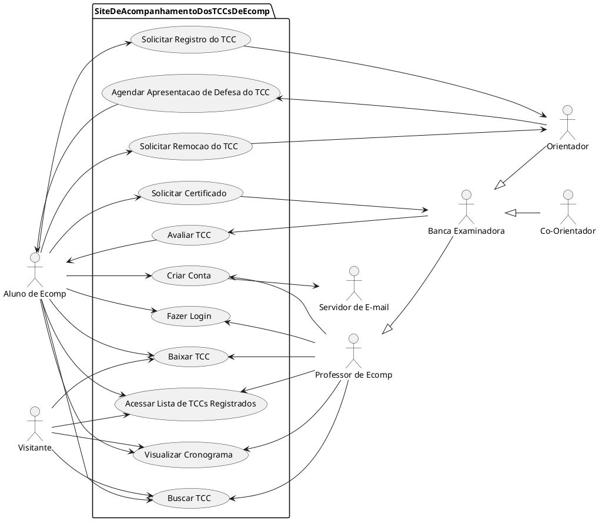

# Especificação dos Requisitos

### Especificações dos Casos de Uso

- [Acessar Lista de TCCs Concluídos](reqs_AcessarListaTCC.md)
- [Agendar Apresentação de Defesa do TCC](reqs_AgendarApresentacao.md)
- [Avaliar TCC](reqs_AvaliarTCC.md)
- [Baixar TCC](reqs_BaixarTCC.md)
- [Buscar TCC](reqs_BuscarTCC.md)
- [Criar Conta](reqs_CriarConta.md)
- [Fazer Login](reqs_FazerLogin.md)
- [Solicitar Certificado](reqs_SolicitarCertificado.md)
- [Solicitar Remoção do TCC](reqs_SolicitarRemocaoTCC.md)
- [Visualizar Cronograma](reqs_VisualizarCronogramaTCC.md)
- [Solicitar Registro do TCC](reqs_solicitarRegistroTCC.md)

### Diagrama dos Casos de Uso

